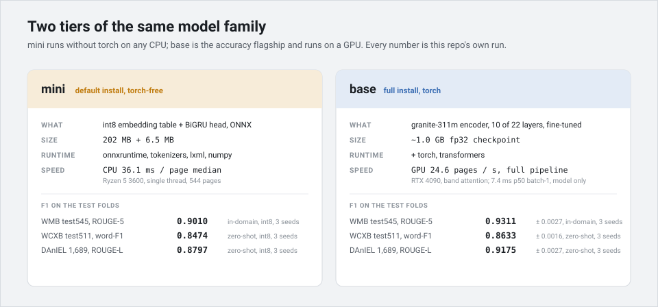
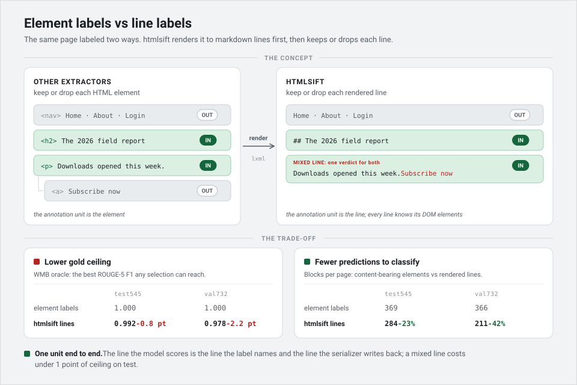
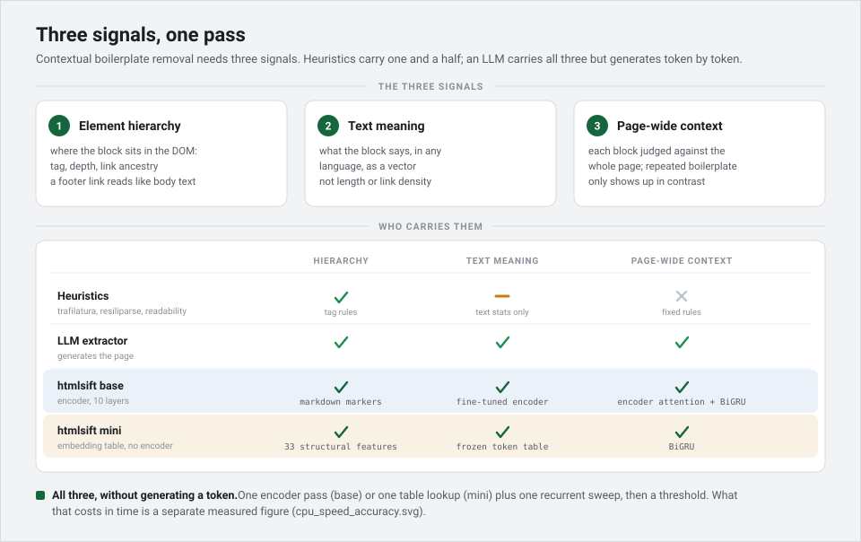
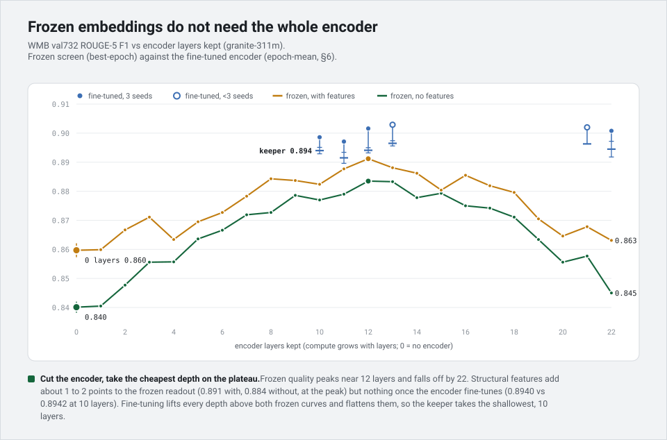
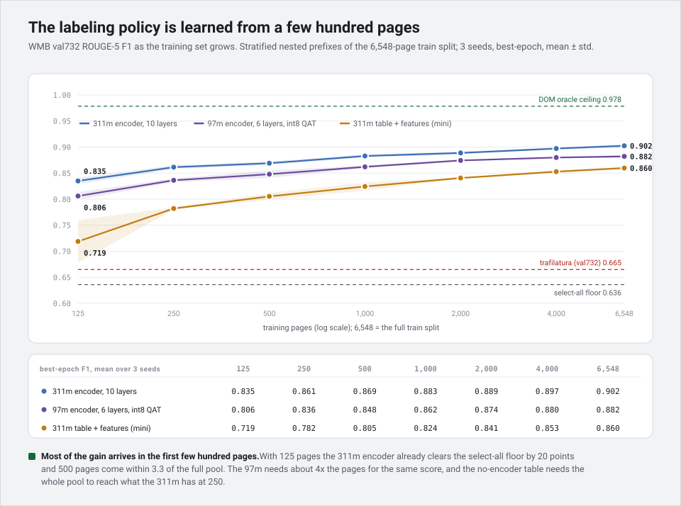
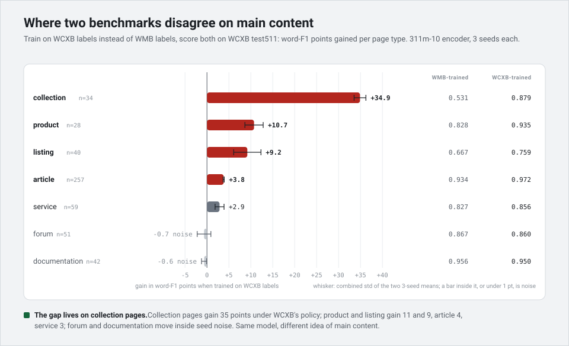
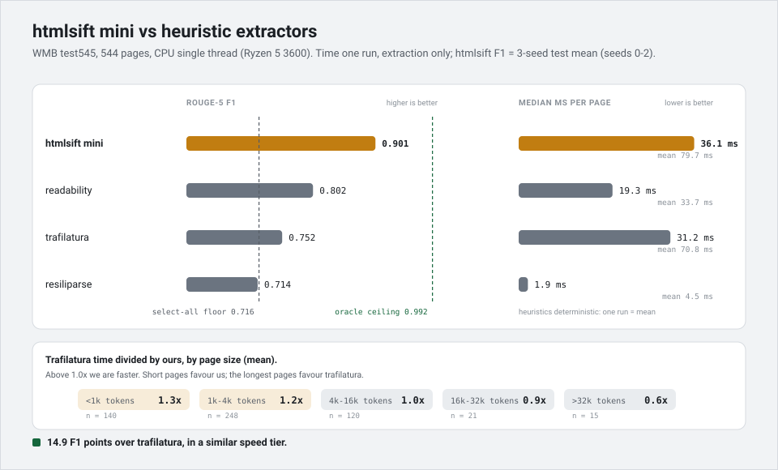
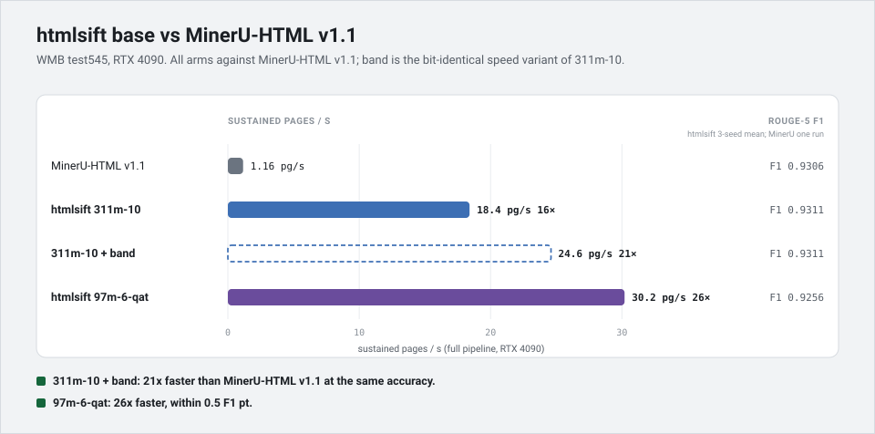
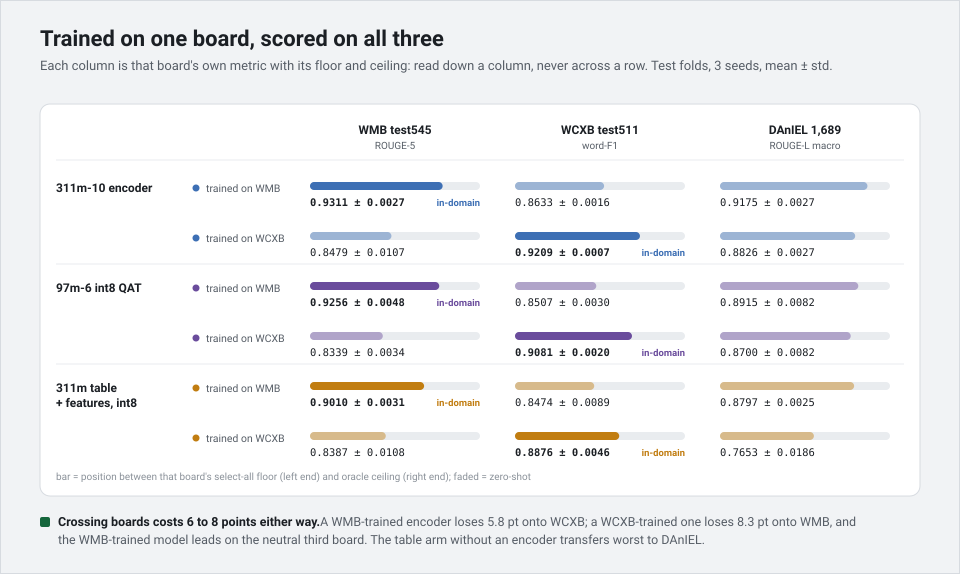
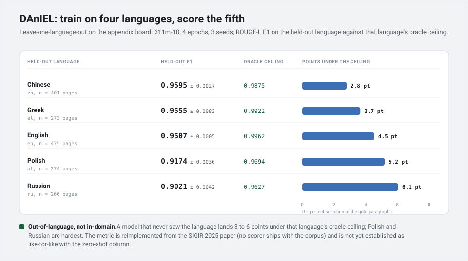

# htmlsift-research

The research harness behind [`htmlsift`](https://github.com/koivualeksi/htmlsift):
training, benchmarks, and the reproduction gate for a contextual main-content extractor.

htmlsift takes a raw HTML string and returns the main content (nav, ads, cookie banners
and footers stripped) by labelling rendered *lines*, not DOM elements. Three models are
trained here on [WebMainBench][wmb] (WMB). 7,825 labelled pages, custom split 6,548 train / 732 val / 545 test. 

Two of the three models are published:
- small int8 `mini` intended for CPU use
- 311M `base` encoder intended for GPU use



To *use* them, `pip install htmlsift`; this repo is where they are trained,
benchmarked, and checked.

[wmb]: https://github.com/opendatalab/WebMainBench

## Datasets

This repo uses three datasets. Both published models train on WMB; all three are used for
scoring.

| dataset | scoring | size | used for |
|---|---|---|---|
| **WMB** (WebMainBench) | ROUGE-5 F1 vs `convert_main_content` | 7,825 (6,548 train / 732 val / 545 test) | training and the primary benchmark |
| **WCXB** | word-level F1, their `evaluate.py` | 2,008 (1,497 dev / 511 test) | second benchmark, and trained on to show annotation-policy differences |
| **DAnIEL** | ROUGE-L | 1,689, five languages | eval only, cross-language generalization |

### WMB

WMB comes as a 7,809-page corpus plus a 545-page test board that share 529 pages, so 7,825
are labelled in total. The 529 shared pages stay out of training; the rest split by domain
into 6,548 train and 732 val, and the board is only ever scored.

Rebuilding the WMB data from source checks itself at each step:

- the 7,809-page corpus renders to `convert_main_content` byte-for-byte
- all 7,825 pages get exact DOM-provenance labels, with no fallback matcher
- the domain split shares no page between train and test
- the DOM oracle ceiling comes out at 0.9918 on test, 0.9784 on val

## Reproduction

Everything runs from a clean clone, and one local GPU is enough for the whole training
path.

### Install

The extras stack. Install the one for what you're doing:

| to | install |
|---|---|
| prepare data and score, no GPU | `pip install -e ".[repro]"` |
| train a model, or run one for predictions | `pip install -e ".[repro,train]"` |
| the CPU speed comparison | `pip install -e ".[repro,bench]"` |

`[repro]` is the base: the renderer, the html2text scorer, and each board's metric, with no
torch. `[train]` adds the torch stack. On a recent GPU, install the matching torch build
from the PyTorch cu128 index first, so pip won't try to reinstall it.

The other three extras aren't needed to reproduce anything. `[runpod]` pushes sweeps to
RunPod, `[bench-gpu]` adds MinerU-HTML for the GPU comparison (it runs only on its own
pod), and `[test]` is pytest for the gate tests.

### Prepare the data

Every board rebuilds from its published source, so you never need a local copy. Each script
downloads, renders, labels, and checks itself at each step. The WMB checks are the list
above. Needs `[repro]`.

```bash
python vendors/wmb/adapter/prepare.py       # data/wmb.jsonl, splits.json, blocks.jsonl (~1.3 GB download)
python vendors/wcxb/adapter/prepare.py
python vendors/daniel/adapter/prepare.py
```

### Train

There are three entry points, and all need `[repro,train]`. The encoder models (`base` and
the lite arm) fine-tune through `finetune.py`. The encoder-free `mini` trains through
`embedding_table.py`. The frozen screen behind the depth choice runs through `frozen.py`.

**Encoder models.** One command builds the arms from its flags:

```bash
python trainers/finetune.py --benchmark wmb --models 311m --layers 10 --seeds 3
```

| flag | what it does | default | applies to |
|---|---|---|---|
| `--benchmark` | target board | `wmb` | `wmb`, `wcxb`, `daniel` |
| `--models` | encoders to sweep (comma list) | `311m,97m` | `311m` (22-layer), `97m` (12-layer) |
| `--layers` | encoder depth: `full`, `all`, or a list/range (`7,11,22`, `1-22`) | `full` | capped per model (311m→22, 97m→12) |
| `--feats` | structural feature groups per arm (`none`, `ABC`, ...) | `none` | all |
| `--caps` | per-block token width cap (`N` or comma list); truncates each block before windowing | `0` (off) | all — width/speed lever |
| `--seeds` | run seeds `0..N-1` | `3` | all |
| `--epochs` | training epochs | `4` | all |
| `--qat-w8a8` | quantization-aware int8 (W8A8) encoder | off | any encoder; not with `--quant-eval` |
| `--quant-eval` | after training, score post-hoc int8 variants (PTQ-dynamic foil + encoder emb-int8) | off | not with `--qat-w8a8` |
| `--export-test` | also export and score the test fold | off | all |
| `--train-limit` | data-efficiency ladder: `N` or `N1,N2,...` in sequence | off | WMB only; multi-value not with `--keep` |
| `--lolo` | DAnIEL leave-one-language-out (all five) | off | DAnIEL only; not with `--holdout`/`--keep` |
| `--holdout` | hold out one DAnIEL language | none | DAnIEL only |
| `--keep` | save the checkpoint | off | one arm only |

`--push` sends the results to a Hugging Face dataset you own (`$HF_RESULTS_DATASET`, or
`--push <repo>`). Nothing is hardcoded and no repo is created for you, so make one under your
account first, or omit `--push` to keep results local. The author's run ledgers stay private and
only `htmlsift-release` is public, so `tools/download_results.py` rebuilds the committed
`results/*.md` from the author's dataset; you reproduce a number by re-running its arm, not by
downloading. Run `finetune.py --help` for the rest (sharding, CPU-smoke limits, head
hyperparameters).

**The mini (embedding table).** There is no encoder to fine-tune, so it pools the
backbone's frozen token-embedding table per line and trains only the head:

```bash
python trainers/embedding_table.py --benchmark wmb --models 311m --emb int8 --feats ABC --seeds 3 --keep
```

`--emb` picks the table variant (`fp32`, `int8`, or both) and replaces `--layers` here. The
other grid flags work as above. This arm is the published `mini`.

**The frozen screen.** No fine-tuning: encode once per layer and train only the head. This
is the layer screen behind *Cut the encoder in half*, val-only, one record per (model,
layer, head, feats, seed):

```bash
python trainers/frozen.py --benchmark wmb --models 311m --layers all --heads bigru --feats ABC --seeds 1
```

### Score

Run a saved model across all three boards, each scored with its own metric (needs
`[repro,train]`):

```bash
python bench/accuracy/predict.py --model wmb-311m-10
```

For a board's ceiling and floor, or to score a predictions file by hand, each board has a
torch-free scorer (`[repro]`):

```bash
python vendors/wmb/adapter/eval.py --fold test              # DOM oracle ceiling
python vendors/wmb/adapter/eval.py --fold test --selectall  # select-all floor
python -X utf8 vendors/wcxb/adapter/evaluate.py --split test --oracle
```

### Speed, and on a pod

The CPU speed-vs-accuracy sheet against the third-party extractors needs `[repro,bench]`:

```bash
python bench/speed/cpu_compare.py
```

Nothing here needs a rented machine, but the author ran the sweeps on RunPod.
`deploy/pod/launch.py` provisions a pod, runs a stage, and pushes results to a Hugging Face
dataset, and `tools/download_results.py` pulls them back into `results/*.md`. The full run
order, pinned versions, and smoke commands are in [`docs/REPRODUCE.md`](docs/REPRODUCE.md).

## How it works

The design in four parts:
- What the model classifies
- What signals are used
- Why the encoder can be shallow
- Why so few labelled pages are enough.

### Label lines, not elements



Most extractors decide keep-or-drop on HTML *elements*. htmlsift first renders the page to
markdown *lines*, then decides keep-or-drop on each line. This allows us to generate significantly smaller amount of predictions per average page, but the oracle gold (every row correct) can't reach 100% if the golden truth is annotated on element level.

So the model's whole job is one keep-or-drop call per line. Doing that well is where the
three signals come in.

### Three signals, one pass



Deciding whether a line is boilerplate needs three signals:

- **Where it sits**: its DOM tag, nesting depth, and whether it's inside a link.
- **What it says**: a multilingual embedding of the line's tokens.
- **The whole-page context**: repeated boilerplate only stands out against the rest of the
  page, so every line is judged against all the others by a BiGRU.

Heuristic extractors carry the first one and a half of these. An LLM carries all three but
pays to generate the page token by token. htmlsift carries all three in one pass, and
outputs a keep/drop probability per line without a decoder.


The two shipped models differ only in that first signal. They share the render, the
per-line pooling and the BiGRU head; `mini` converts text to tokens and mean-pools them,
with no internal attention (fast on CPU), while `base` runs the first 10 layers of the
granite r2 311M embedder (a GPU model). The next two sections are why it is only the first
10 layers, and why so few labelled pages are enough to train it.

### Cut the encoder in half



Frozen embedding quality peaks near layer 12 and *falls* toward layer 22, so depth isn't
free. Structural features lift the frozen readout a point or two (val 0.891 with, 0.884
without, at the peak) but add nothing once the encoder fine-tunes. Fine-tuning then
flattens layers 10 through 22, so `base` takes the shallowest that works, **10 of 22
layers**, at no measured cost on val. (int8 QAT is accuracy-neutral; details in
[`docs/CLAIMS.md`](docs/CLAIMS.md).)

### Learns the policy fast



Most of the accuracy arrives in the first few hundred labelled pages. The model learns a
benchmark's labelling policy quickly, so retraining on your own labels is cheap. On 311m-10 only 125 pages
already clear the select-all floor by 20 points (0.835 vs 0.636, best-epoch val732); 500 come
within 3.3 points of the full 6,548-page train split (0.869 vs 0.902).

## "Main content" is a policy, not a fact

But the policy it learns is only as good as the benchmark it learned from, and the
benchmarks disagree on what "main content" even is.



WMB and WCXB don't just contain different pages. They encode different <em>labelling policies</em>. Train the same 311m-10 encoder on each, score both on WCXB, and the gap concentrates on <strong>collection</strong> pages (an e-commerce category page): 0.53 for the WMB-trained model against 0.88 for the WCXB-trained one, +34.9 word-F1. On forums and documentation the two agree within a point.

<table>
<tr valign="top">
<td width="60%"></td>
<td width="40%">

The pages show it plainly. On a product-grid page, WCXB keeps the intro blurb and the whole grid; WMB keeps the heading and drops the grid (on <code>apeainthepod.com/&hellip;/tees-and-tanks</code>, 2 of 809 blocks are main content). Where the policies point at the same thing (arxiv abstracts, nytimes article bodies) they agree.

</td>
</tr>
</table>

The extractors we compare against are no exception. Each carries its own idea of main
content, and it surfaces the moment you score one on a benchmark it was not built for.
trafilatura, tuned for articles, leads the heuristics on WCXB and then falls to the back on
the multilingual news of DAnIEL. readability is the reverse, strong on DAnIEL and last on
WCXB. resiliparse trails on both. None of them is broken. Each fits one policy and misses
another, the same split the benchmarks show.

Because our models learn the policy instead of hard-coding it, they hold up across both.
Trained on WMB and run zero-shot, base scores above every heuristic on each board; mini, the
CPU model, lands just behind the strongest heuristic on each and clears the other two. So it
never tops a board it was not trained on, but it is the consistent one, and when the policy
does not match yours you retrain it (see [Retraining on your own data](#retraining-on-your-own-data)).

| model | WCXB, word-F1 | DAnIEL, ROUGE-L |
|---|---|---|
| base (311m-10) | 0.8633 | 0.9175 |
| mini (int8 table) | 0.8474 | 0.8797 |
| trafilatura | 0.8584 | 0.8265 |
| readability | 0.7653 | 0.8925 |
| resiliparse | 0.7909 | 0.7094 |

WCXB test511, DAnIEL 1,689 (macro over five languages), zero-shot. Read down each column,
not across: the two metrics differ. Regenerate with `bench/accuracy/heuristics.py`.

Two things follow, and the rest of this repo depends on them: cross-board numbers are
policy comparisons, not model rankings; and no model is trained on a board it is scored
against. It is also why the results below are read down each column, never across. Full
treatment in [`docs/annotation-divergence.md`](docs/annotation-divergence.md).

## Results

| model | desc | WMB test F1 | seeds | CPU (pages/s) | GPU (pages/s) |
|---|---|---|---|---|---|
| `base` | 311m-10 | **0.9311 ± 0.0027** | 3 | 0.4 | 24.6 |
| lite (unpublished) | 97m-6, int8 QAT | 0.9256 ± 0.0048 | 3 | 0.9 | 30.2 |
| `mini` | int8 table | 0.9010 ± 0.0031 | 3 | **27.7** | — |

WMB test545, ROUGE-5 F1 against `convert_main_content`, n=544, threshold 0.5, 3-seed
means. Read against the select-all floor 0.7156 and the DOM oracle ceiling 0.9918.
GPU = RTX 4090; CPU = Ryzen 5 3600, single thread. The full arm sweep (encoder depth, QAT,
features) is in [`docs/CLAIMS.md`](docs/CLAIMS.md).

### On CPU



One CPU core, WMB test (544 pages), extraction only. `mini` gets close to trafilatura's
per-page time (36 vs 31 ms median) and scores ~15 F1 points higher. readability and
resiliparse are faster but markedly less accurate. It is **not** a speed win; the win is
accuracy at the heuristic tier (see [Scope & honesty](#scope--honesty)).

<details>
<summary>Per-method CPU numbers</summary>

| method | median ms | pages/s | F1 |
|---|---|---|---|
| **htmlsift (mini)** | 36.1 | 27.7 | **0.8994** |
| trafilatura | 31.2 | 32.0 | 0.7525 |
| readability | 19.3 | 51.7 | 0.8016 |
| resiliparse | 1.9 | 522.5 | 0.7135 |

mini's F1 here is the seed-1 ONNX keeper (the single model timed in this run); its 3-seed
accuracy mean is 0.9010 ± 0.0031, in the Results table above.

</details>

### On GPU



RTX 4090, WMB test. Throughput is over all 545 pages; one page has no
`convert_main_content` reference, so the F1 is the 3-seed mean over the other 544. `base`
ships with band attention (bit-identical output, just faster) and sustains 24.6 pages/s
against MinerU-HTML v1.1's 1.16, a 21x gap at matched accuracy (F1 0.9311 vs 0.9306). The
median-latency ratio (~126x) is larger, and is *not* the throughput ratio: a few whale
pages set the sustained rate. Batch-1 latency is model-only for us and whole-call for
MinerU, so the columns are shown, not divided.

<details>
<summary>Latency and throughput table</summary>

| system | sustained pg/s | batch-1 p50 | batch-1 p90 | F1 |
|---|---|---|---|---|
| MinerU-HTML v1.1 | 1.16 | 844 ms | 3,343 ms | 0.9306 |
| **htmlsift 311m-10** (band, shipped) | 24.6 | 7.4 ms | 45.2 ms | **0.9311 ± 0.0027** |
| 311m-10, no band | 18.4 | 6.7 ms | 73.6 ms | same weights, bit-identical |
| 97m-6-qat (fp32 forward) | 30.2 | 4.2 ms | 37.8 ms | 0.9256 ± 0.0048 |

</details>

### Cross-benchmark accuracy



The shipped models are trained on WMB, so WMB is in-domain. The other two columns are
**zero-shot**: the model never saw WCXB or the multilingual DAnIEL in training. Each
column is scored with that benchmark's own metric, and is comparable down a column, never
across a row.

<details>
<summary>Cross-board numbers</summary>

| model | WMB (ROUGE-5) | WCXB (word-F1) | DAnIEL (ROUGE-L) |
|---|---|---|---|
| `base` (311m-10) | 0.9311 | 0.8633 | 0.9175 |
| `mini` (int8) | 0.9010 | 0.8474 | 0.8797 |

</details>

A WMB-trained model loses 5.8 points moving to WCXB; trained the other way round it loses
8.3 moving to WMB, and trails on the neutral third board. The asymmetry is the
annotation-policy gap above. Full matrix, per-type and per-language, in
[`results/generalization.md`](results/generalization.md).

### DAnIEL: train on four languages, score the fifth



DAnIEL is eval-only, except here: leave-one-language-out trains on four languages and
scores the held-out fifth, so every number is out-of-language. It carries the one
multilingual claim WMB can't (only 27 Chinese test pages there). The metric is ROUGE-L,
reimplemented from the SIGIR 2025 paper (there is no scorer to vendor). Read against the
macro floor 0.4984 and ceiling 0.9816.

<details>
<summary>Per-language numbers</summary>

| held out | n | F1 |
|---|---|---|
| Chinese | 401 | 0.9595 ± 0.0027 |
| Greek | 273 | 0.9555 ± 0.0083 |
| English | 475 | 0.9507 ± 0.0005 |
| Polish | 274 | 0.9174 ± 0.0030 |
| Russian | 266 | 0.9021 ± 0.0042 |

</details>

311m-10, 4 epochs, 3 seeds.

### What we tried

Roughly 500 runs in total (seed-expanded). Most are the frozen screen, which probed every layer
(22 on 311m, 12 on 97m) against four heads (BiGRU, linear, transformer, XGBoost) and two feature
sets; the rest are the fine-tune, cross-board, data-efficiency and speed runs the table below draws on.

val732 best-epoch unless a row says test545; 3 seeds where a spread is shown, else a single screen seed.

| lever | what we compared | result | verdict |
|---|---|---|---|
| backbone size | 311m vs 97m encoder | test 0.9311 vs 0.9215 | 311m ships as base (F1); 97m is the unpublished lite arm |
| frozen screen | probe every layer frozen, pick the readout depth | 311m peaks ~L12 (0.891 with feats, 0.884 without), falls to 0.863 / 0.845 at L22; 97m peaks L5 (0.881 / 0.875), 0.841 / 0.797 at L12 | accuracy lives mid-stack, so cut there |
| cut the encoder | keep 10/22 (311m), 6/12 (97m) vs full | test 0.9311 vs 0.9348 (311m); 0.9215 vs 0.9224 (97m) | flat, so halve the layers at no accuracy cost |
| head type | BiGRU vs linear vs transformer vs XGBoost | finetuned 97m-6: 0.8903 / 0.8745 / 0.8791; frozen: BiGRU > XGB > linear > transformer | BiGRU |
| BiGRU size | hidden 256 vs 128 | 0.8546 vs 0.8531; head 2.8x faster, ~12% faster end-to-end (CPU) | flat accuracy; 128's ~12% end-to-end gain is not decision-grade at this speed tier, so 256 ships |
| structural features (ABC) | none vs depth/link/tag feats | frozen +1.5-3 pt (311m L12 XGB 0.855 -> 0.870); finetuned +0.35 | help frozen/table, redundant once finetuned; kept in mini |
| QAT W8A8 | quant-aware int8 encoder vs fp32 | +0.01 epoch-mean / -0.23 best-epoch | accuracy-neutral; the int8 of the unpublished 97m-6-qat lite arm; size, not CPU speed |
| PTQ-dynamic | post-training int8, no retrain | -0.38 pt val and test (3 seeds) | dead foil: loses accuracy, no speedup, QAT dominates |
| emb-int8 | int8 the encoder embedding table | -0.02 val / +0.01 test | flat, so kept as a size lever |
| width cap | truncate long blocks before windowing | 97m-6 none 0.890 vs cap64 0.896 (1 seed) | speed/width lever, not accuracy |
| band attention | chunked band attention, bit-identical weights | GPU 18.4 -> 24.6 pg/s (311m-10) | speed lever, same accuracy |
| data efficiency | train on 125 -> 6,548 pages | 125 pages already 0.835 vs 0.902 full | policy learns from a few hundred pages |
| embedding table (mini) | drop the encoder: embeddings + BiGRU + feats | test 0.9010 vs 0.9311 encoder | ~3 pt under, fastest CPU, so the mini artifact |

## Retraining on your own data

The labelling policy is learned, not baked in, so htmlsift retrains on your own labels
cheaply. A few hundred pages already learn a policy (see [Learns the policy
fast](#learns-the-policy-fast)). Point a `Benchmark` at your pages and run `finetune.py`.

The one thing you supply is per-line labels, and how you build them depends on what your
gold looks like:

- **Element-level annotations** (your gold marks main-content DOM elements): reuse WMB's
  DOM-provenance labeler in `vendors/wmb/adapter/blocks.py`. It renders the page once and
  marks a line as main when one of its source elements is in your annotated set. Exact, no
  matcher.
- **Clean main-content text** (your gold is the extracted text, with no DOM): reuse the
  WCXB and DAnIEL path in `vendors/shared/labeling.py`. It aligns your reference text to the
  rendered blocks and hill-climbs to the word-F1 fixpoint.

The per-board metric, split, and labelling contract are in
[`docs/PROTOCOL.md`](docs/PROTOCOL.md). Run order and smoke commands are in
[`docs/REPRODUCE.md`](docs/REPRODUCE.md).

## Documentation

- [`docs/PROTOCOL.md`](docs/PROTOCOL.md): metric, splits, rendering and labelling per board.
- [`docs/CLAIMS.md`](docs/CLAIMS.md): every published number and the command that regenerates it.
- [`docs/REPRODUCE.md`](docs/REPRODUCE.md): corpus acquisition, environment, run order.
- [`docs/LIMITS.md`](docs/LIMITS.md): scope, caveats and retractions.

## Scope & honesty

The load-bearing caveats, in full in [`docs/LIMITS.md`](docs/LIMITS.md):

- **Not faster than trafilatura or resiliparse on CPU.** The win is accuracy; the speed
  sits at the heuristic tier. The one speed win is GPU throughput against MinerU-HTML,
  above.
- **The accuracy win is in-domain, not universal.** On WMB our models clear the heuristics
  by a wide margin. Zero-shot on other annotation policies the margin shrinks: base still
  edges every heuristic on WCXB and DAnIEL, while mini lands just behind the board leader on
  each and ahead of the rest. Full table under [Main content is a policy](#main-content-is-a-policy-not-a-fact).
- **311m encoder depth is not decision-grade on test.** 311m-22 beats 311m-10 by 0.37,
  inside the seed noise, so no depth claim either way. The 97m half is flat 6 → 12.
- **The GPU claim is sustained throughput at matched accuracy**, on one card type against
  one competitor. Never the ~126x median-latency ratio, and never across cards or against a
  CPU tool.
- **No full-set WMB number.** Training uses 6,548 of 7,809; published full-set boards are
  context only, every baseline re-run under this harness.
- **WCXB has 139 dev/test duplicates**, used as-is; WMB's raw html carries the annotators'
  selection marker, stripped from our input but visible to a competitor fed the raw page.

Some claims from the R&D path are retracted and stay retracted (`docs/LIMITS.md`).

## License

GPL-3.0-or-later. This repo imports `html2text` as the scorer (WMB's metric is defined
against its output), which is acceptable here and only here: it is a reproduction harness,
not a distributed library. That is the reason the pip package renders with lxml instead,
and can be Apache-2.0.

The GPL covers this harness, not the models it produces. Trained weights are outputs, not
a derivative of the code, so they carry no copyleft obligation: the published `base` and
`mini` weights are **Apache-2.0** (matching the `htmlsift` package and its Hugging Face
repo), and weights you train by retraining on your own data are yours to license as you
choose.

## References

- **WMB — WebMainBench.** The training benchmark; ROUGE-5 main-content metric.
  Liu et al., *Dripper: Token-Efficient Main HTML Extraction with a Lightweight LM*.
  [arXiv:2511.23119](https://arxiv.org/abs/2511.23119) ·
  [repo](https://github.com/opendatalab/WebMainBench)
- **WCXB — Web Content Extraction Benchmark.** Foley, *WCXB: A Multi-Type Web Content
  Extraction Benchmark*. [arXiv:2605.21097](https://arxiv.org/abs/2605.21097) ·
  [repo](https://github.com/Murrough-Foley/web-content-extraction-benchmark)
- **DAnIEL.** Multilingual news corpus (Mutuvi et al.,
  [LREC 2020](https://aclanthology.org/2020.lrec-1.509/)); main-content scoring follows
  *Multilingual Evaluation of Main Content Extractors for Web Pages*, SIGIR 2025
  ([ACM](https://dl.acm.org/doi/10.1145/3726302.3730234)).
- **Backbone.** granite-embedding-311m-multilingual-r2
  ([HF](https://huggingface.co/ibm-granite/granite-embedding-311m-multilingual-r2)).
